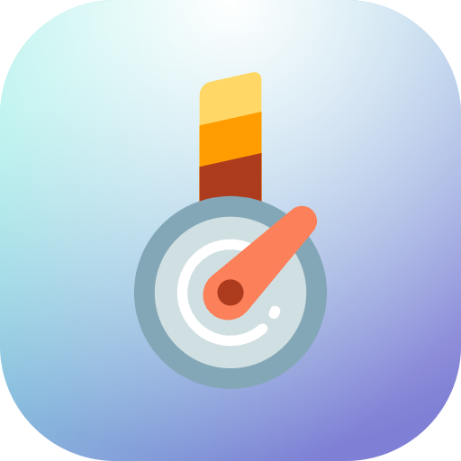
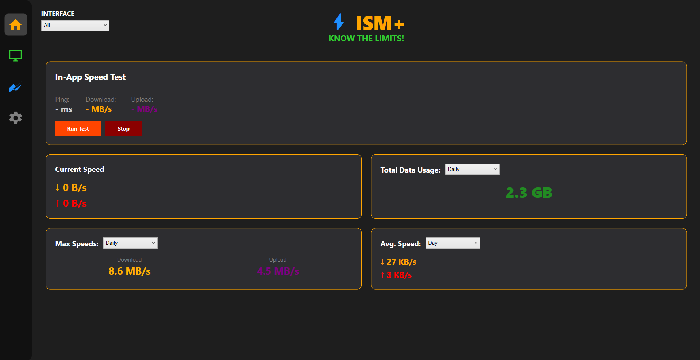
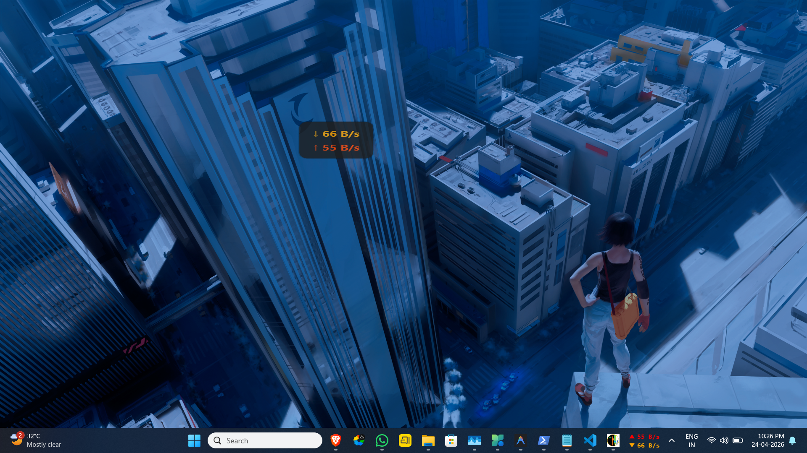
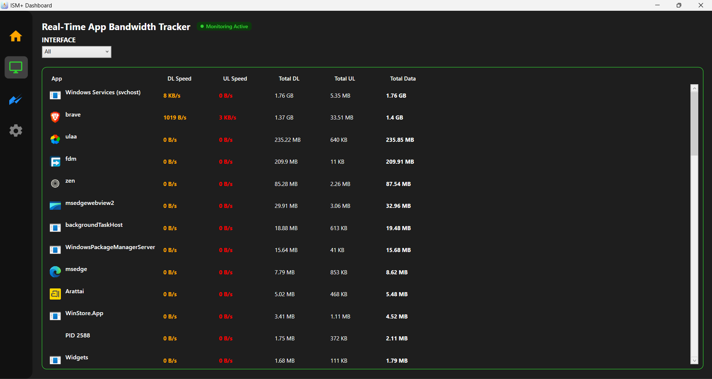
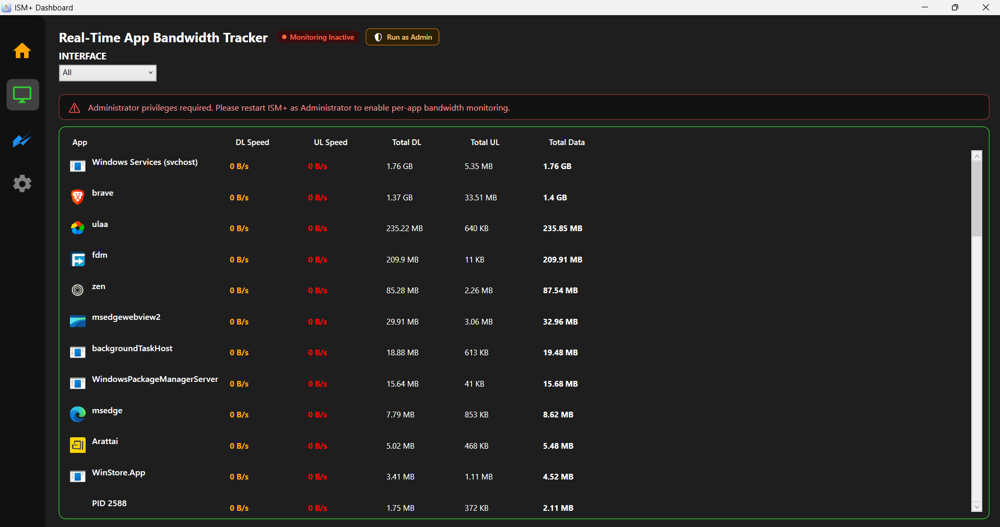
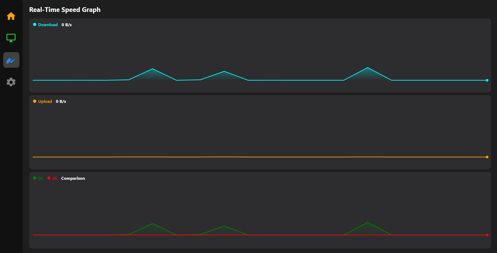
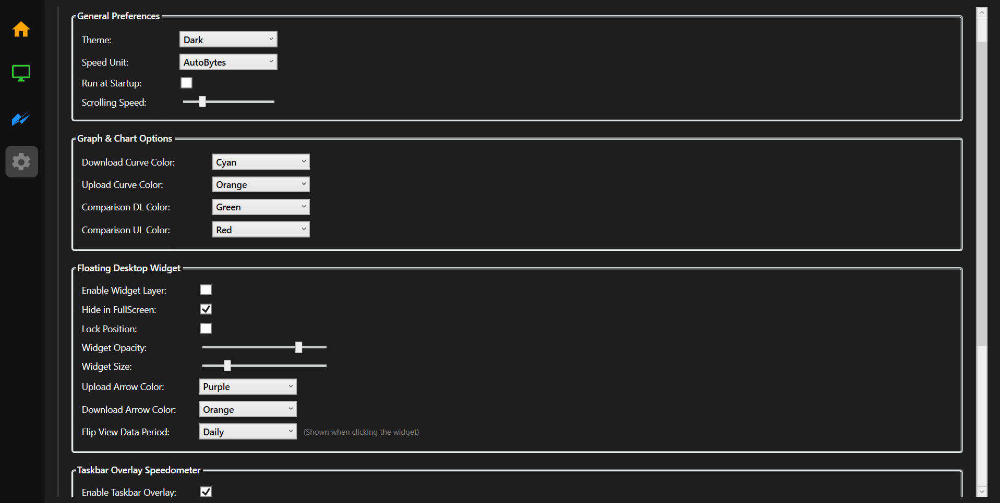

<div align="center">



# ⚡ ISM+ — Internet Speed Meter Plus

**Know the Limits. Free & Open Source.**

[](https://github.com)
[](LICENSE)
[](https://dotnet.microsoft.com)
[](https://apps.microsoft.com/detail/9ncl3jrpkhtw)

</div>

---

## 📖 Overview

**ISM+** is a lightweight, always-on network speed monitor for Windows 10 and 11. It lives in the system tray and gives you a real-time view of your download/upload speeds, per-app data usage, and historical stats — all in one clean dashboard.

This repository contains the **Free (open-source)** edition. A [**Pro edition**](https://apps.microsoft.com/detail/9ncl3jrpkhtw) is available on the Microsoft Store with additional features.

---

### 📸 Screenshots

| Home Tab | Widgets |
| :---: | :---: |
|  |  |
| **Monitoring Active** | **Monitoring Inactive** |
|  |  |
| **Graph Tab** | **Settings** |
|  |  |

---

## ✨ Free Features

| Feature | Free | Pro |
|---|:---:|:---:|
| Real-time download / upload speed display | ✅ | ✅ |
| System tray icon with live speed | ✅ | ✅ |
| Taskbar overlay speedometer | ✅ | ✅ |
| Daily data usage stats | ✅ | ✅ |
| Max speed tracking (Daily) | ✅ | ✅ |
| Dark / Light theme | ✅ | ✅ |
| Multiple speed units (KB/s, MB/s, Mbps, …) | ✅ | ✅ |
| Run at startup | ✅ | ✅ |
| **In-app speed test (Ping / DL / UL)** | 🔒 | ✅ |
| **Per-app bandwidth monitor** | 🔒 | ✅ |
| **Real-time speed graph** | 🔒 | ✅ |
| **Average speed tracking** | 🔒 | ✅ |
| **Floating desktop widget** | 🔒 | ✅ |
| **Taskbar Overlay Flip (Data usage view)** | 🔒 | ✅ |

> 🔒 **Locked features** are available in [ISM+ Pro](https://apps.microsoft.com/detail/9ncl3jrpkhtw) on the Microsoft Store.

---

## 🚀 Installation

### Option 1 — Portable (No Install)

1. Download `ISM+.exe` from Releases Section
2. Double-click to run


### Option 2 — Installer (Inno Setup)

1. Download `ISM_Plus_Setup.exe` from Releases Section
2. Run the installer — it handles everything automatically
---

## 🛡️ Administrative Privileges

The Free edition of **ISM+** is designed to be lightweight and does not require administrative privileges for core functionality.

For advanced features such as the **Real-Time App Bandwidth Tracker** (which uses Windows ETW), you must upgrade to **ISM+ Pro**.

---

## 📁 Repository Structure

```
ISM+/
├── Assets
├── README.md
└── Source
    ├── app.manifest
    ├── App.xaml
    ├── App.xaml.cs
    ├── AssemblyInfo.cs
    ├── Icon1.ico
    ├── MainWindow.xaml
    ├── MainWindow.xaml.cs
    ├── NetMonitor.csproj
    ├── nuget.config
    ├── TaskbarOverlayWindow.xaml
    └── TaskbarOverlayWindow.xaml.cs
```

---

## 🌟 ISM+ Pro

Want the **Floating Desktop Widget** and **Taskbar Overlay Speedometer**?

**[Get ISM+ Pro on the Microsoft Store →](https://apps.microsoft.com/detail/9ncl3jrpkhtw)**

ISM+ Pro unlocks the full potential of your network monitoring:
- 🪟 **Floating Widget** — a customisable semi-transparent speed widget on your desktop
- 📊 **Real-Time Graphs** — beautiful, smooth graphs tracking historical speed
- 🔍 **Per-App Monitor** — track exactly which apps are consuming your bandwidth
- ⏱️ **In-App Speed Test** — ping, download, and upload benchmarks
- 📈 **Advanced Stats** — average speeds and monthly/yearly maximums
- 🔄 **Taskbar Flip View** — tap the taskbar overlay to see total data used

---

> App story: It took me about 3 months to build this from scratch starting from the logo only, changed the logo 3 times, writing codes, fixing it for good, making it stable for all the systems, sending links to friends to download, it took me a lot of hardwork and dedication. I hope you guys would love using this app, though the app has a paid version which most of us don't like but the free version would also take care of most of the tasks. Please shower your love and support for this app ❤️

<div align="center">
Made with ❤️ for Windows power users.
</div>
